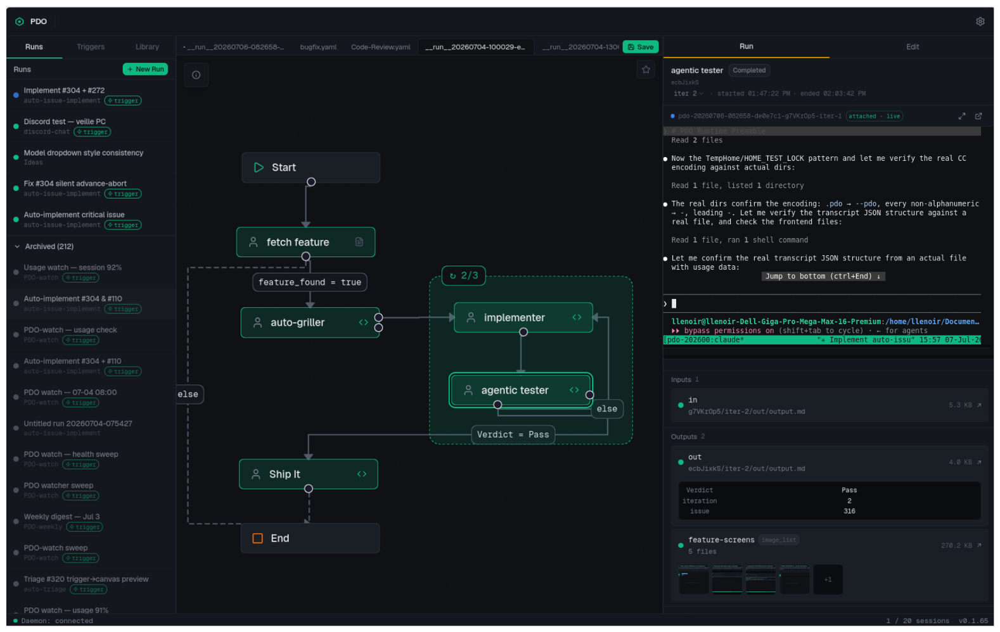

# Prompt Driven Orchestrator (PDO)

**PDO is a graphical, agentic orchestrator built for software development.**
You design pipelines on a visual canvas and run them on a deterministic runtime that keeps agents on the rails.

- **Deterministic routing** decides what runs next by mechanical rules, not an LLM's guess, so pipelines don't drift.
- **Typed, enforced outputs** make every step produce a structured artifact you can read and trust, so you always understand what happened.
- **Interactive Claude Code sessions** back every node, with a terminal right in the web UI: step in any time to watch, correct, or take over the development loop.
- **Automated triggers** start pipelines on a schedule or from a script's signal, hands-free.



*A feature pipeline mid-run: a bounded implement/test loop, a live session in the web UI, and typed outputs the runtime routes on.*

## Install

```bash
curl -fsSL https://github.com/Loulen/prompt-driven-orchestrator/releases/latest/download/install.sh | bash
```

This downloads the latest release binary for your platform (Linux/macOS, x86_64/ARM64), verifies the SHA256 checksum, and installs to `~/.local/bin/pdo`.

To install a specific version:

```bash
PDO_VERSION=v0.1.0 curl -fsSL https://github.com/Loulen/prompt-driven-orchestrator/releases/latest/download/install.sh | bash
```

Then start the daemon:

```bash
pdo daemon
```

Open `http://localhost:5172` in your browser.

For **unattended Triggers** (the daemon starts at boot and survives logout, instead of dying when you close your session), install it as a persistent service:

```bash
pdo service install          # systemd --user unit (Linux) / launchd LaunchAgent (macOS)
pdo service install --dry-run # preview the unit + commands, change nothing
pdo service status            # inspect the installed service
```

## Design principles

**Deterministic orchestration.** The graph decides what runs next by mechanical rules on typed outputs, never an LLM router. Agents do the work inside each node, but they never decide the path between nodes, so a pipeline runs the same way every time and does not drift. ([ADR-0002](docs/adr/0002-mechanical-conditionals-only.md), [ADR-0011](docs/adr/0011-conditional-edges-and-loop-regions.md))

**Tailored, typed outputs you can read and trust.** This is the heart of PDO. Each node emits a document whose shape you designed: a schema-checked frontmatter (verdict, score, decisions) plus a body that can be markdown, a mermaid diagram, an image set, or whatever fits the decision. The runtime validates it on completion (with one bounded chance for the agent to self-correct), routes the graph from it, feeds it to the next node as compact context, and keeps it after the run as a durable, auditable record. Your solution's reasoning becomes structured knowledge instead of a lost chat log. ([ADR-0020](docs/adr/0020-archive-preserves-outputs.md))

**Expert in the loop.** The evolution of "human in the loop". Rather than babysitting a run, the expert is handed only the information a decision actually needs, in the format built to convey it. That is the reason the outputs are typed and tailored: less watching, more pertinent input. And when you do step in, every node is a real Claude Code session with a terminal in the web UI, so you can watch, converse, correct, or take over. Mark a node `interactive` and it waits for your input by design. ([ADR-0005](docs/adr/0005-inline-xterm-over-os-spawn.md))

**Deliberate, then autonomous.** The default keeps the expert in the loop; full autonomy is something a pipeline earns, never a favor the runtime grants. PDO never pushes, opens PRs, or merges on its own: only a node you placed does. A pipeline behaves identically whether you launch it by hand or a trigger fires it. ([ADR-0012](docs/adr/0012-triggers-and-trust-earned-autonomy.md))

**It's your Claude Code.** PDO does not manage skills or config. Sessions load your `~/.claude` skills, your MCP servers, and your setup verbatim.

See [CONTEXT.md](CONTEXT.md) for the full domain model.

## Prerequisites (development)

- [Rust](https://rustup.rs/) (stable)
- [Node.js](https://nodejs.org/) >= 22

## Local development

### Frontend (Vite HMR)

```bash
cd frontend
npm install
npm run dev
```

The Vite dev server starts on `http://localhost:5173` and proxies `/ws` to the daemon at `127.0.0.1:5172`.

### Daemon

```bash
cargo run -p pdo-daemon -- daemon
# or with a custom port:
cargo run -p pdo-daemon -- daemon --port 9999
```

The daemon binds to `127.0.0.1:5172` by default. In dev mode it shows a placeholder page — use the Vite dev server for frontend work.

### Production build

```bash
cd frontend && npm run build && cd ..
cargo build --release -p pdo-daemon
```

The release binary embeds the frontend `dist/` via `rust-embed` and serves it at `/`.

### CLI

```bash
cargo run -p pdo-daemon -- --help
```

## Build & test commands

| Purpose             | Command                                              |
| ------------------- | ---------------------------------------------------- |
| Type-check Rust     | `cargo check --workspace --all-targets`              |
| Test Rust           | `cargo test --workspace`                             |
| Lint Rust           | `cargo clippy --workspace --all-targets -- -D warnings` |
| Format Rust         | `cargo fmt --all --check`                            |
| Type-check frontend | `cd frontend && npm run typecheck`                   |
| Test frontend       | `cd frontend && npm run test`                        |
| Lint frontend       | `cd frontend && npm run lint`                        |
| Build frontend      | `cd frontend && npm run build`                       |

## Architecture

See [CONTEXT.md](CONTEXT.md) for the domain glossary and `docs/adr/` for architectural decisions.
