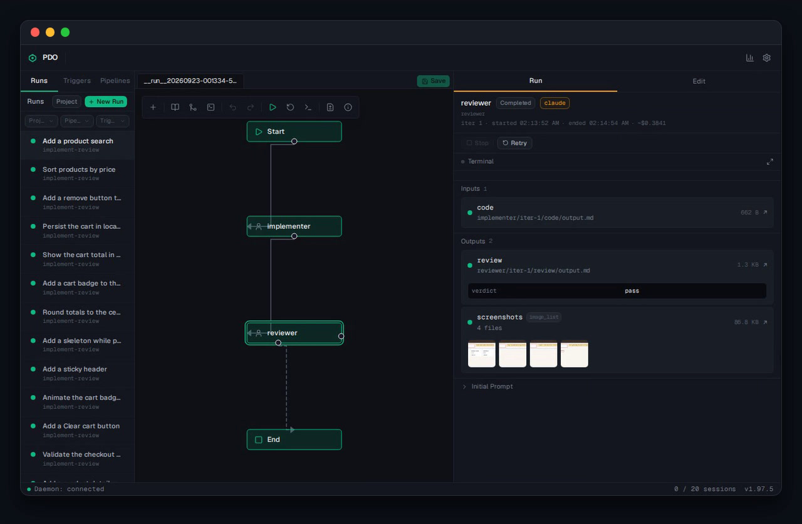
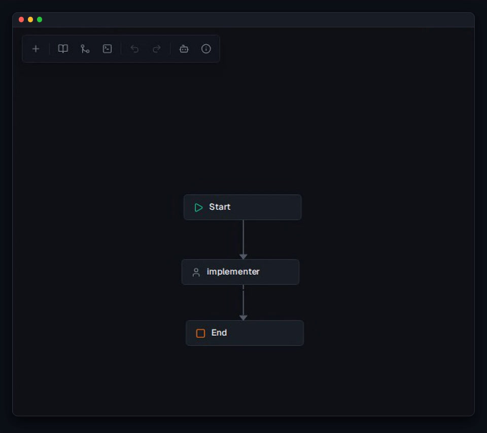
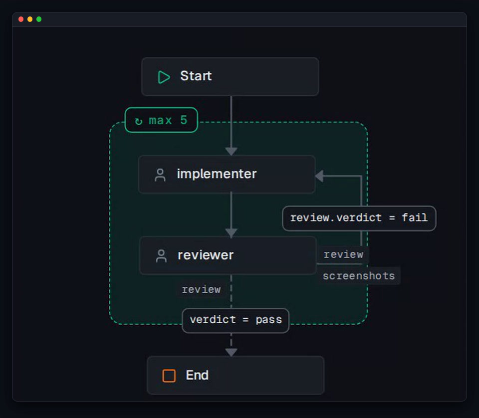
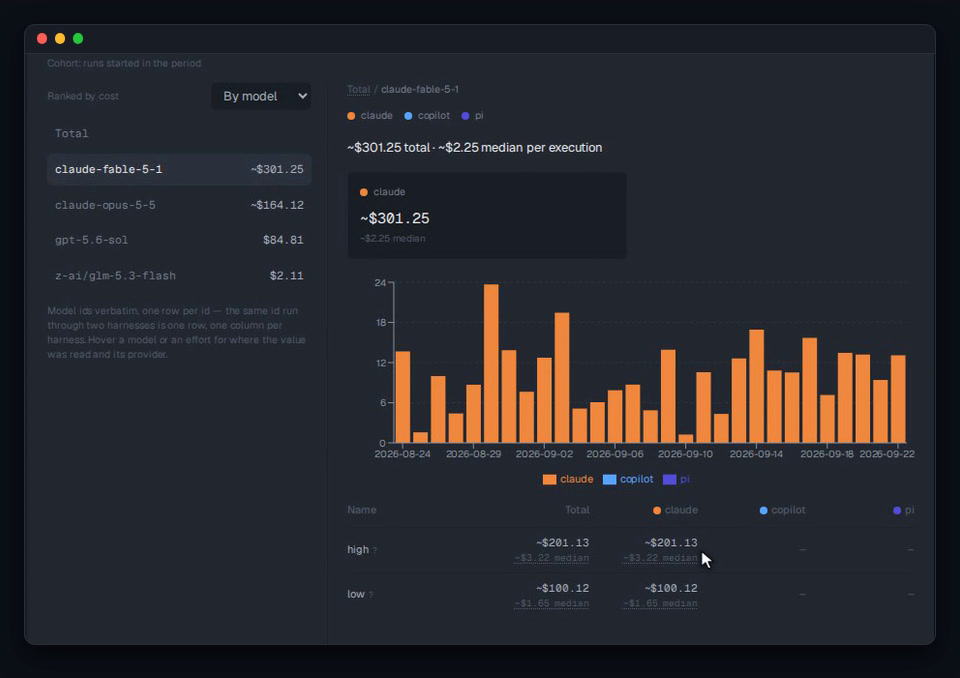

<h1 align="center">PDO</h1>

<p align="center">
  <a href="https://github.com/Loulen/prompt-driven-orchestrator/releases/latest"></a>
  <a href="LICENSE"></a>
  
</p>

<p align="center">
  <sub><strong>English</strong> · <a href="docs/readme/README.fr.md">Français</a></sub>
</p>

<p align="center">
  <strong>The visual orchestrator for coding agents.</strong><br/>
  For 100x devs who still care about the craft.
</p>

<h3 align="center"><a href="#install"><ins>Install PDO</ins></a></h3>

<!-- Media slots: `make readme-media` publishes each scene to docs/assets/readme/<scene>.gif with its
     poster docs/assets/readme/<scene>.jpg (scenes: hero, pipelines, routing, outputs, review, triggers,
     stats, orchestration, profiles, skills). Until a scene is published, its slot shows docs/pdo-ui.png.
     In each <picture>: the reduced-motion <source> takes the poster, the other <source> the GIF
     (type="image/gif"), the  the poster. README.md and docs/readme/README.fr.md share the media. -->
<p align="center">
  <a href="docs/features.md"><picture><source media="(prefers-reduced-motion: reduce)" srcset="docs/assets/readme/hero.jpg"><source srcset="docs/assets/readme/hero.gif" type="image/gif"></picture></a>
</p>

## Features

<table>
<tr>
<td width="50%" valign="middle">

### Visual pipelines

Build agent workflows on a canvas: drop an `implementer` node, drag its edge to `end`. Plain YAML underneath.

[Docs →](docs/features.md#visual-pipelines)

</td>
<td width="50%">
  <!-- scene: pipelines -->
  <a href="docs/features.md#visual-pipelines"><picture><source media="(prefers-reduced-motion: reduce)" srcset="docs/assets/readme/pipelines.jpg"><source srcset="docs/assets/readme/pipelines.gif" type="image/gif"></picture></a>
</td>
</tr>
<tr>
<td width="50%" valign="middle">

### Conditional routing &amp; loops

Drag an edge back from `reviewer` to `implementer` and set `verdict != pass`. Routing reads typed outputs, never an LLM's judgment.

[Docs →](docs/features.md#conditional-routing--loops)

</td>
<td width="50%">
  <!-- scene: routing -->
  <a href="docs/features.md#conditional-routing--loops"><picture><source media="(prefers-reduced-motion: reduce)" srcset="docs/assets/readme/routing.jpg"><source srcset="docs/assets/readme/routing.gif" type="image/gif"></picture></a>
</td>
</tr>
<tr>
<td width="50%" valign="middle">

### Typed outputs

Each node declares what it hands over (markdown with frontmatter, image lists, files) and PDO validates it before the next node starts.

[Docs →](docs/features.md#typed-outputs)

</td>
<td width="50%">
  <!-- scene: outputs -->
  <a href="docs/features.md#typed-outputs"><picture><source media="(prefers-reduced-motion: reduce)" srcset="docs/pdo-ui.png"><source srcset="docs/pdo-ui.png"></picture></a>
</td>
</tr>
<tr>
<td width="50%" valign="middle">

### Diff review

Comment any line of a run's diff and send it to the run's manager agent. Its answer lands in the thread, and the fix goes back into the pipeline.

[Docs →](docs/features.md#diff-review)

</td>
<td width="50%">
  <!-- scene: review -->
  <a href="docs/features.md#diff-review"><picture><source media="(prefers-reduced-motion: reduce)" srcset="docs/pdo-ui.png"><source srcset="docs/pdo-ui.png"></picture></a>
</td>
</tr>
<tr>
<td width="50%" valign="middle">

### Triggers

Fire a pipeline on a cron, behind a guard script: `* * * * *` + `./prod-health-check.sh` turns a prod outage into an incident run, with the report as input.

[Docs →](docs/features.md#triggers)

</td>
<td width="50%">
  <!-- scene: triggers -->
  <a href="docs/features.md#triggers"><picture><source media="(prefers-reduced-motion: reduce)" srcset="docs/pdo-ui.png"><source srcset="docs/pdo-ui.png"></picture></a>
</td>
</tr>
<tr>
<td width="50%" valign="middle">

### Run stats by model

Cost, duration and failure rate per model and per node, from your own runs. See what Opus 5.5, Fable 5.1, GPT-5.6 Sol and GLM-5.3 Flash really cost you.

[Docs →](docs/features.md#run-stats-by-model)

</td>
<td width="50%">
  <!-- scene: stats -->
  <a href="docs/features.md#run-stats-by-model"><picture><source media="(prefers-reduced-motion: reduce)" srcset="docs/assets/readme/stats.jpg"><source srcset="docs/assets/readme/stats.gif" type="image/gif"></picture></a>
</td>
</tr>
<tr>
<td width="50%" valign="middle">

### Recursive orchestration

A node can launch child pipelines from its own session. Children nest under their parent in the run tree, and the Orchestration tab tracks them to the end.

[Docs →](docs/features.md#recursive-orchestration)

</td>
<td width="50%">
  <!-- scene: orchestration -->
  <a href="docs/features.md#recursive-orchestration"><picture><source media="(prefers-reduced-motion: reduce)" srcset="docs/pdo-ui.png"><source srcset="docs/pdo-ui.png"></picture></a>
</td>
</tr>
<tr>
<td width="50%" valign="middle">

### Agent profiles

Name a harness · model · effort once. Change the profile and every node that follows it switches, with no node to edit.

[Docs →](docs/features.md#agent-profiles)

</td>
<td width="50%">
  <!-- scene: profiles -->
  <a href="docs/features.md#agent-profiles"><picture><source media="(prefers-reduced-motion: reduce)" srcset="docs/pdo-ui.png"><source srcset="docs/pdo-ui.png"></picture></a>
</td>
</tr>
<tr>
<td width="50%" valign="middle">

### Skill bank

Import skills from a repo or write them by hand, then give them to any node from the skill picker.

[Docs →](docs/features.md#skill-bank)

</td>
<td width="50%">
  <!-- scene: skills -->
  <a href="docs/features.md#skill-bank"><picture><source media="(prefers-reduced-motion: reduce)" srcset="docs/pdo-ui.png"><source srcset="docs/pdo-ui.png"></picture></a>
</td>
</tr>
</table>

**Also in the box:**

- **[Isolated worktrees](docs/features.md#isolated-worktrees)** — every run gets its own git worktree, and each node picks isolated or shared.
- **[Live sessions](docs/features.md#live-sessions)** — watch any node's terminal, type into it, or take over.
- **[Sandbox](docs/features.md#sandbox)** — run nodes in a container profile, with the harness home staged for you.
- **[Multi-repo runs](docs/features.md#multi-repo-runs)** — one run that works across several repositories.
- **[Guided tours](docs/features.md#guided-tours)** — the app walks you through your first pipeline, one step at a time.
- **[Page mounts](docs/features.md#page-mounts)** — agents serve prototypes and reports under `/pages/<name>/` for you to review.
- **[Service &amp; in-app update](docs/features.md#service--in-app-update)** — `pdo service install` keeps it running; one click in the status bar updates it.
- **And more** — the [changelog](CHANGELOG.md) is the real feature list.

---

## Natively supported agents

Works with **any harness**: if it runs in a terminal, a descriptor makes it a PDO node.

<p>
  <a href="https://docs.anthropic.com/en/docs/claude-code/overview"><kbd> Claude Code</kbd></a> &nbsp;
  <a href="https://opencode.ai/docs/cli/"><kbd> OpenCode</kbd></a> &nbsp;
  <a href="https://docs.github.com/en/copilot/how-tos/set-up/install-copilot-cli"><kbd> GitHub Copilot</kbd></a> &nbsp;
  <a href="https://pi.dev"><kbd> Pi</kbd></a> &nbsp;
  <a href="docs/reference/harnesses.md"><kbd>+ any harness</kbd></a>
</p>

---

## Install

### Install — macOS, Linux

```bash
# Homebrew (macOS, Linux)
brew install Loulen/tap/pdo

# or the install script (Linux, macOS · x86_64, ARM64)
curl --proto '=https' --tlsv1.2 -LsSf https://github.com/Loulen/prompt-driven-orchestrator/releases/latest/download/pdo-daemon-installer.sh | sh
```

PDO needs `tmux`, `git` and at least one authenticated agent harness.

### Start

```bash
pdo daemon            # then open http://localhost:5172
pdo service install   # start at boot, keep running after logout
```

Updating, service options and every CLI command: [docs/reference/cli.md](docs/reference/cli.md).

---

## Developing

Want to contribute or run PDO from source? See [CONTRIBUTING.md](CONTRIBUTING.md). Reference docs (CLI, reverse proxy, terminal, harness support) live in [docs/reference/](docs/reference/).

## License

PDO is free and open source under the [MIT License](LICENSE): use it, modify it, embed it, host it, for any purpose.
