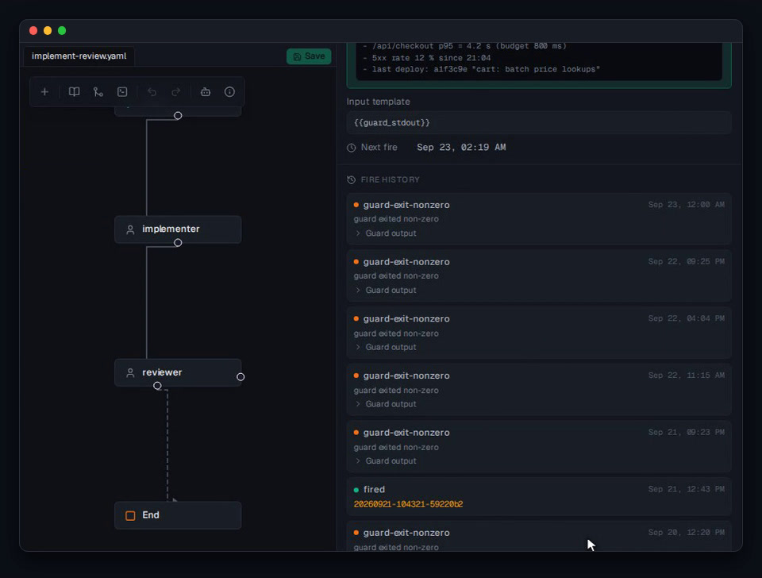
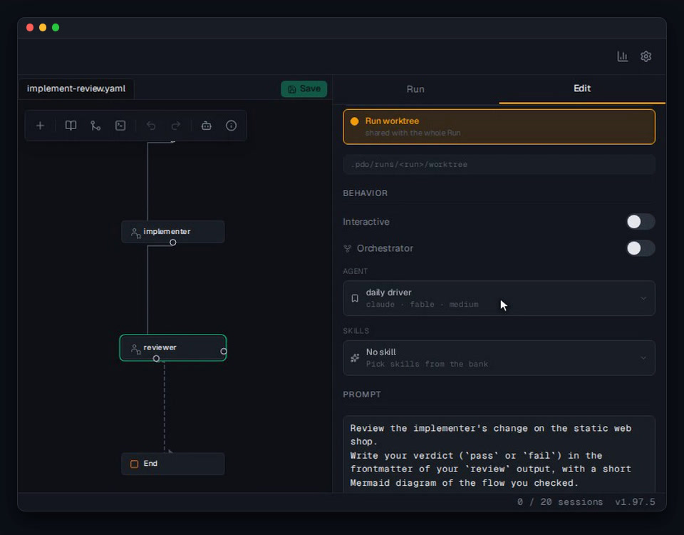
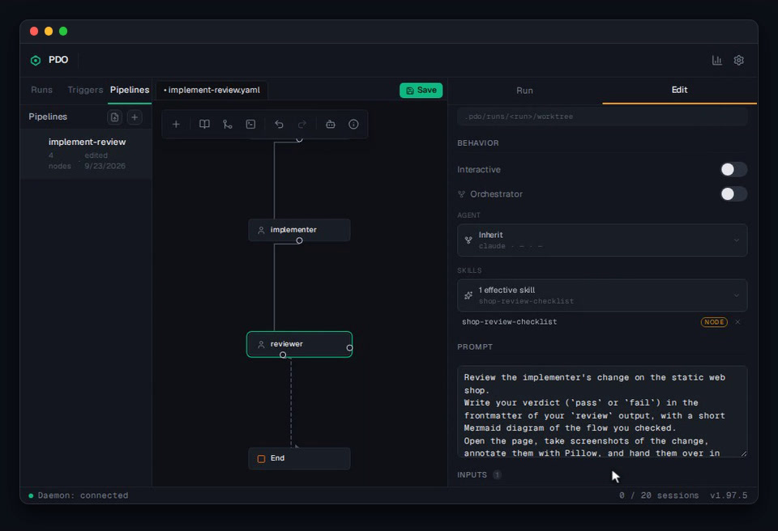

<h1 align="center">PDO</h1>

<p align="center">
  <a href="https://github.com/Loulen/prompt-driven-orchestrator/releases/latest"></a>
  <a href="../../LICENSE"></a>
  
</p>

<p align="center">
  <sub><a href="../../README.md">English</a> · <strong>Français</strong></sub>
</p>

<p align="center">
  <strong>L'orchestrateur visuel pour agents de code.</strong><br/>
  Pour les devs 100x qui tiennent encore au travail bien fait.
</p>

<h3 align="center"><a href="#installation"><ins>Installer PDO</ins></a></h3>

<!-- Media slots: `make readme-media` publishes each scene to docs/assets/readme/<scene>.gif with its
     poster docs/assets/readme/<scene>.jpg (scenes: hero, pipelines, routing, outputs, review, triggers,
     stats, orchestration, profiles, skills). Until a scene is published, its slot shows docs/pdo-ui.png.
     In each <picture>: the reduced-motion <source> takes the poster, the other <source> the GIF
     (type="image/gif"), the  the poster. README.md and docs/readme/README.fr.md share the media. -->
<p align="center">
  <a href="../../docs/features.md"><picture><source media="(prefers-reduced-motion: reduce)" srcset="../../docs/assets/readme/hero.jpg"><source srcset="../../docs/assets/readme/hero.gif" type="image/gif"></picture></a>
</p>

## Fonctionnalités

<table>
<tr>
<td width="50%" valign="middle">

### Pipelines visuels

Construisez vos workflows d'agents sur un canvas : posez un nœud `implementer`, tirez son arête jusqu'à `end`. Du YAML simple en dessous.

[Docs →](../../docs/features.md#visual-pipelines)

</td>
<td width="50%">
  <!-- scene: pipelines -->
  <a href="../../docs/features.md#visual-pipelines"><picture><source media="(prefers-reduced-motion: reduce)" srcset="../../docs/assets/readme/pipelines.jpg"><source srcset="../../docs/assets/readme/pipelines.gif" type="image/gif"></picture></a>
</td>
</tr>
<tr>
<td width="50%" valign="middle">

### Routage conditionnel et boucles

Tirez une arête de `reviewer` vers `implementer` et posez `verdict != pass`. Le routage lit des outputs typés, jamais le jugement d'un LLM.

[Docs →](../../docs/features.md#conditional-routing--loops)

</td>
<td width="50%">
  <!-- scene: routing -->
  <a href="../../docs/features.md#conditional-routing--loops"><picture><source media="(prefers-reduced-motion: reduce)" srcset="../../docs/assets/readme/routing.jpg"><source srcset="../../docs/assets/readme/routing.gif" type="image/gif"></picture></a>
</td>
</tr>
<tr>
<td width="50%" valign="middle">

### Outputs typés

Chaque nœud déclare ce qu'il transmet (markdown avec frontmatter, listes d'images, fichiers) et PDO le valide avant que le nœud suivant démarre.

[Docs →](../../docs/features.md#typed-outputs)

</td>
<td width="50%">
  <!-- scene: outputs -->
  <a href="../../docs/features.md#typed-outputs"><picture><source media="(prefers-reduced-motion: reduce)" srcset="../../docs/pdo-ui.png"><source srcset="../../docs/pdo-ui.png"></picture></a>
</td>
</tr>
<tr>
<td width="50%" valign="middle">

### Revue du diff

Commentez n'importe quelle ligne du diff d'un run et envoyez-la à son agent manager. Sa réponse arrive dans le fil, et le correctif repart dans le pipeline.

[Docs →](../../docs/features.md#diff-review)

</td>
<td width="50%">
  <!-- scene: review -->
  <a href="../../docs/features.md#diff-review"><picture><source media="(prefers-reduced-motion: reduce)" srcset="../../docs/pdo-ui.png"><source srcset="../../docs/pdo-ui.png"></picture></a>
</td>
</tr>
<tr>
<td width="50%" valign="middle">

### Triggers

Lancez un pipeline sur un cron, derrière un script de garde : `* * * * *` + `./prod-health-check.sh` transforme une panne de prod en run d'incident, avec le rapport en input.

[Docs →](../../docs/features.md#triggers)

</td>
<td width="50%">
  <!-- scene: triggers -->
  <a href="../../docs/features.md#triggers"><picture><source media="(prefers-reduced-motion: reduce)" srcset="../../docs/assets/readme/triggers.jpg"><source srcset="../../docs/assets/readme/triggers.gif" type="image/gif"></picture></a>
</td>
</tr>
<tr>
<td width="50%" valign="middle">

### Stats par modèle

Coût, durée et taux d'échec par modèle et par nœud, tirés de vos propres runs. Voyez ce que vous coûtent vraiment Opus 5.5, Fable 5.1, GPT-5.6 Sol et GLM-5.3 Flash.

[Docs →](../../docs/features.md#run-stats-by-model)

</td>
<td width="50%">
  <!-- scene: stats -->
  <a href="../../docs/features.md#run-stats-by-model"><picture><source media="(prefers-reduced-motion: reduce)" srcset="../../docs/assets/readme/stats.jpg"><source srcset="../../docs/assets/readme/stats.gif" type="image/gif"></picture></a>
</td>
</tr>
<tr>
<td width="50%" valign="middle">

### Orchestration récursive

Un nœud peut lancer des pipelines enfants depuis sa propre session. Les enfants se rangent sous leur parent dans l'arbre de runs, et l'onglet Orchestration les suit jusqu'au bout.

[Docs →](../../docs/features.md#recursive-orchestration)

</td>
<td width="50%">
  <!-- scene: orchestration -->
  <a href="../../docs/features.md#recursive-orchestration"><picture><source media="(prefers-reduced-motion: reduce)" srcset="../../docs/pdo-ui.png"><source srcset="../../docs/pdo-ui.png"></picture></a>
</td>
</tr>
<tr>
<td width="50%" valign="middle">

### Profils agentiques

Nommez une fois un couple harnais · modèle · effort. Changez le profil, et tous les nœuds qui le suivent basculent, sans nœud à modifier.

[Docs →](../../docs/features.md#agent-profiles)

</td>
<td width="50%">
  <!-- scene: profiles -->
  <a href="../../docs/features.md#agent-profiles"><picture><source media="(prefers-reduced-motion: reduce)" srcset="../../docs/assets/readme/profiles.jpg"><source srcset="../../docs/assets/readme/profiles.gif" type="image/gif"></picture></a>
</td>
</tr>
<tr>
<td width="50%" valign="middle">

### Banque de skills

Importez des skills depuis un dépôt ou écrivez-les à la main, puis donnez-les à n'importe quel nœud depuis le sélecteur de skills.

[Docs →](../../docs/features.md#skill-bank)

</td>
<td width="50%">
  <!-- scene: skills -->
  <a href="../../docs/features.md#skill-bank"><picture><source media="(prefers-reduced-motion: reduce)" srcset="../../docs/assets/readme/skills.jpg"><source srcset="../../docs/assets/readme/skills.gif" type="image/gif"></picture></a>
</td>
</tr>
</table>

**Aussi dans la boîte :**

- **[Worktrees isolés](../../docs/features.md#isolated-worktrees)** — chaque run a son propre worktree git, et chaque nœud choisit isolé ou partagé.
- **[Sessions live](../../docs/features.md#live-sessions)** — regardez le terminal de n'importe quel nœud, tapez dedans ou reprenez la main.
- **[Sandbox](../../docs/features.md#sandbox)** — faites tourner des nœuds dans un profil conteneur, avec le home du harnais préparé pour vous.
- **[Runs multi-dépôts](../../docs/features.md#multi-repo-runs)** — un seul run qui travaille sur plusieurs dépôts.
- **[Tours guidés](../../docs/features.md#guided-tours)** — l'app vous accompagne dans votre premier pipeline, une étape à la fois.
- **[Page mounts](../../docs/features.md#page-mounts)** — les agents servent prototypes et rapports sous `/pages/<name>/` pour que vous les relisiez.
- **[Service et mise à jour intégrée](../../docs/features.md#service--in-app-update)** — `pdo service install` le garde en marche ; un clic dans la barre d'état le met à jour.
- **Et bien plus** — le [changelog](../../CHANGELOG.md) est la vraie liste des fonctionnalités.

---

## Agents supportés nativement

Fonctionne avec **n'importe quel harnais** : s'il tourne dans un terminal, un descripteur en fait un nœud PDO.

<p>
  <a href="https://docs.anthropic.com/en/docs/claude-code/overview"><kbd> Claude Code</kbd></a> &nbsp;
  <a href="https://opencode.ai/docs/cli/"><kbd> OpenCode</kbd></a> &nbsp;
  <a href="https://docs.github.com/en/copilot/how-tos/set-up/install-copilot-cli"><kbd> GitHub Copilot</kbd></a> &nbsp;
  <a href="https://pi.dev"><kbd> Pi</kbd></a> &nbsp;
  <a href="../../docs/reference/harnesses.md"><kbd>+ n'importe quel harnais</kbd></a>
</p>

---

## Installation

### Installation — macOS, Linux

```bash
# Homebrew (macOS, Linux)
brew install Loulen/tap/pdo

# ou le script d'installation (Linux, macOS · x86_64, ARM64)
curl --proto '=https' --tlsv1.2 -LsSf https://github.com/Loulen/prompt-driven-orchestrator/releases/latest/download/pdo-daemon-installer.sh | sh
```

PDO a besoin de `tmux`, de `git` et d'au moins un harnais d'agent authentifié.

### Démarrer

```bash
pdo daemon            # puis ouvrez http://localhost:5172
pdo service install   # démarre au boot, reste actif après la déconnexion
```

Mises à jour, options du service et toutes les commandes CLI : [docs/reference/cli.md](../../docs/reference/cli.md).

---

## Développer

Envie de contribuer ou de lancer PDO depuis les sources ? Voir [CONTRIBUTING.md](../../CONTRIBUTING.md). La documentation de référence (CLI, reverse proxy, terminal, support des harnais) vit dans [docs/reference/](../../docs/reference/).

## Licence

PDO est libre et open source, sous [licence MIT](../../LICENSE) : utilisez-le, modifiez-le, embarquez-le, hébergez-le, pour tout usage.
